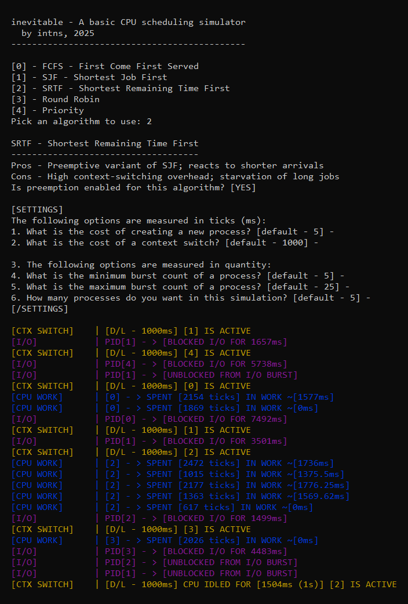

# inevitable

`inevitable` is a C++ command-line tool for simulating a basic CPU, complete with mock processes, scheduling algorithms, and interrupts. I developed this project while studying operating systems to pass an exam.

## Table of Contents

- [Features](#features)
- [Building and Running](#building-and-running)
- [Configuration Options](#configuration-options)
- [System Design](#system-design)
- [Future Enhancements / To-Do](#future-enhancements--to-do)
- [Appendix](#appendix)

## Features

- Implements various scheduling algorithms:
  - First-Come, First-Served (FCFS)
  - Shortest Job First (SJF)
  - Shortest Remaining Time First (SRTF)
  - Round Robin (RR)
  - Priority Scheduling
- CPU / I/O burst simulation
- Basic CPU execution model
- Interrupt-driven I/O
- Process state transitions
- Preemptive and non-preemptive modes
- Priority aging
- Exponential burst prediction
- Configurable parameters
- Color-coded console logs

## Building and Running

Binaries are automatically compiled using Github Actions, and are available in the Releases tab. You can also, alternatively, compile it manually. This project uses CMake to manage the build process.

1. **Prerequisites**:
    - C++20 (or later) compiler (GCC, Clang, MSVC).
    - CMake (3.10+ recommended).

2. **Compilation (using CMake)**:
    Navigate to the project root directory (where the main `CMakeLists.txt` is located).

    ```bash
    # Create a build directory
    mkdir build
    cd build

    # Configure the project and generate build files
    # (e.g., Makefiles on Linux/macOS, Visual Studio solution on Windows)
    cmake .. 

    # Compile the project
    # This will produce 'inevitable' or 'inevitable.exe' in the build directory 
    cmake --build .
    ```

3. **Running**:
    - After a successful build, the executable will typically be found in the `build` directory.
    - The program will then prompt you to choose a scheduling algorithm and configure simulation parameters.

## Configuration Options

When the simulator starts, configure:

- Scheduling Algorithm: Select from implemented algorithms.
- Process Creation Cost: Time (ticks/ms) for new process creation.
- Context Switch Cost (Dispatch Latency): Time (ticks/ms) for context switch.
- Minimum Process Burst Count: Min CPU/I/O bursts per process.
- Maximum Process Burst Count: Max CPU/I/O bursts per process.
- Number of Processes: Total processes to simulate.
- Round Robin Time Quantum (if RR selected): RR time slice duration (ticks/ms).
- Initial Burst Prediction (used by SJF/SRTF): Initial assumed CPU burst length.

## System Design

- `CPU`: Simulates the CPU, fetching and executing scheduled processes, handling context switches and state transitions.
- `Process` / `ProcessControlBlock (PCB)`: `Process` defines task work (CPU/I/O bursts). `PCB` stores process metadata (state, ID, priority, etc.).
- `IScheduler` (Interface): Base class for scheduling algorithms.
  - Concrete Schedulers: `FCFSScheduler`, `SJFScheduler`, `SRTFScheduler`, `RRScheduler`, `PriorityScheduler` implement specific logic.
- `InterruptController`: Manages I/O-blocked processes, simulating completion and returning them to the ready queue.
- `ProcessWork`: Defines a CPU or I/O work burst with a specific duration.
- Configuration (`cfg` namespace & `main.cpp`): User-configurable global settings (creation cost, dispatch latency, etc.).

## Future Enhancements / To-Do

- Output simulation results (metrics) to CSV for analysis / potential website visualisation.
- Add multi-level (feedback) queue scheduling.

## Appendix

The following is a screenshot of the program during runtime:

<p align="center">
  
</p>

---

By intns, 2025.
